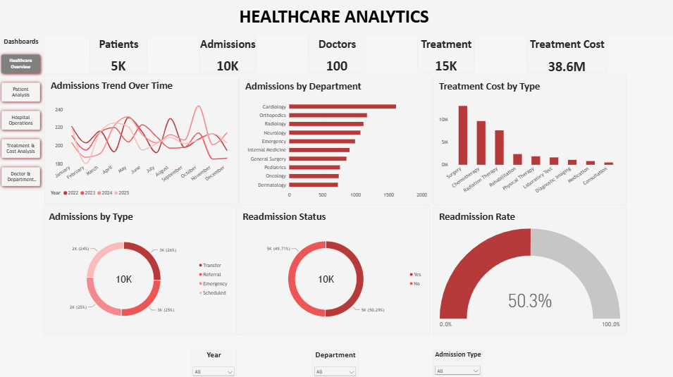
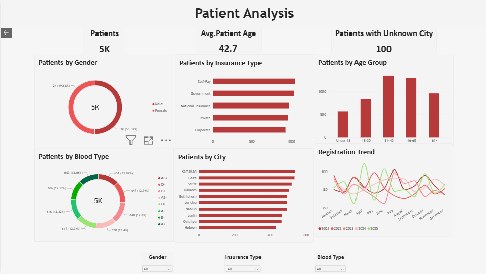
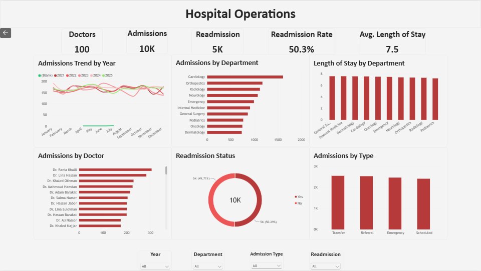
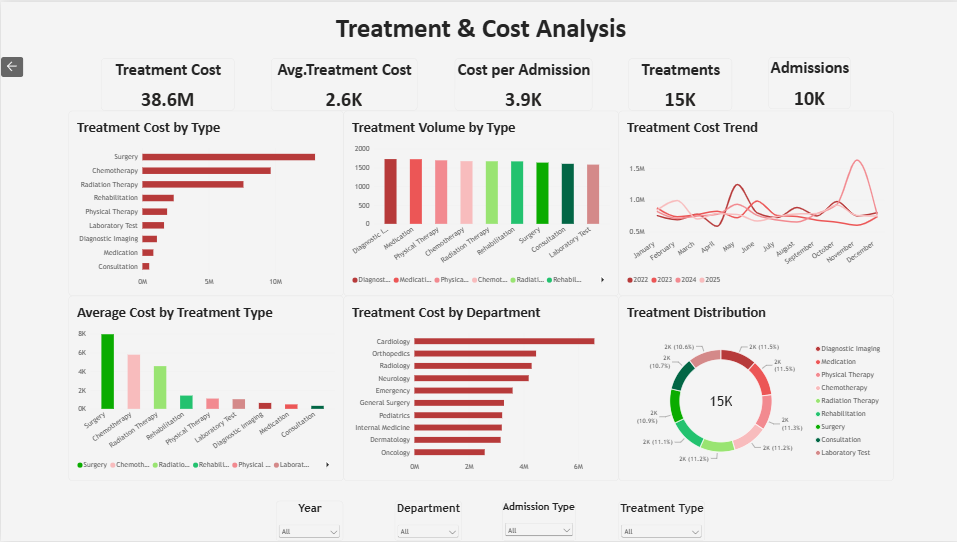
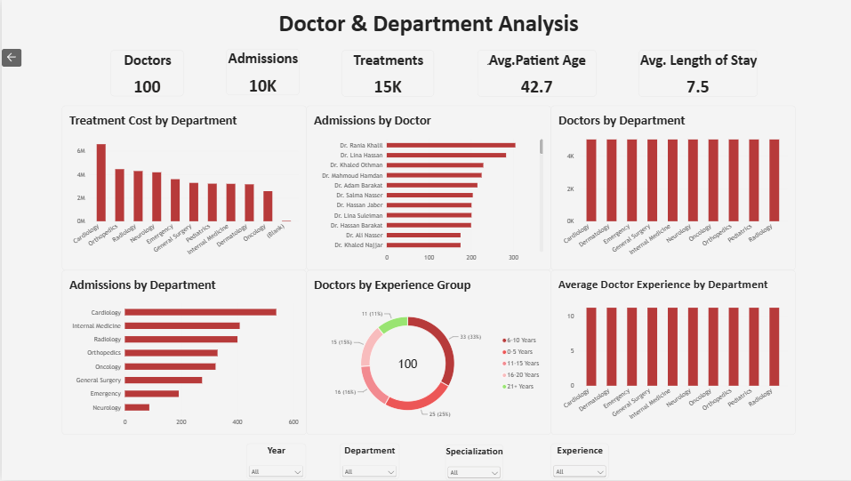

# Healthcare Analytics — Power BI

## 📊 Project Overview

**Healthcare Analytics** is an interactive Power BI portfolio project designed to analyze hospital operations, patient demographics, admissions, doctors, treatments, and treatment costs.

The project demonstrates an end-to-end Data Analytics workflow:

- Data cleaning and quality checks
- Data modeling and relationships
- DAX measures
- Interactive dashboards
- Operational and cost analysis
- Business insight generation

---

## 🎯 Project Objectives

The dashboard was built to answer questions such as:

- How many patients, admissions, doctors, and treatments are recorded?
- How are admissions distributed across departments and admission types?
- What is the recorded readmission rate?
- Which treatment types contribute most to treatment costs?
- How does treatment cost vary across departments?
- How are patients distributed by age, gender, insurance type, blood type, and city?
- How are doctors distributed across departments and experience groups?

---

## 🗂️ Dataset

The project uses five raw CSV datasets:

| Dataset | Description |
|---|---|
| `Patients_Raw.csv` | Patient demographics and registration information |
| `Admissions_Raw.csv` | Hospital admission and discharge records |
| `Doctors_Raw.csv` | Doctor information and experience |
| `Departments_Raw.csv` | Hospital departments and branches |
| `Treatments_Raw.csv` | Treatment records and treatment costs |

### Main entities

**Patients**
- Patient_ID
- Patient_Name
- Gender
- Age
- City
- Blood_Type
- Insurance_Type
- Registration_Date

**Admissions**
- Admission_ID
- Patient_ID
- Doctor_ID
- Department_ID
- Admission_Date
- Discharge_Date
- Diagnosis
- Admission_Type
- Readmission

**Doctors**
- Doctor_ID
- Doctor_Name
- Specialization
- Department_ID
- Years_of_Experience

**Departments**
- Department_ID
- Department_Name
- Hospital_Branch

**Treatments**
- Treatment_ID
- Admission_ID
- Treatment_Type
- Treatment_Date
- Treatment_Cost

---

## 🧹 Data Cleaning & Transformation

Data preparation was performed in Power Query.

Key cleaning steps included:

- Replacing missing text values with `Unknown` where appropriate
- Validating patient ages and replacing invalid/missing ages with the calculated median
- Validating doctor experience and replacing invalid/missing values with the calculated median
- Detecting duplicate patient and doctor identifiers
- Validating foreign keys between dimension and fact tables
- Handling invalid Patient_ID values in admissions
- Validating admission and discharge dates
- Calculating Length of Stay
- Detecting and handling negative treatment costs
- Preserving legitimate zero treatment costs
- Handling missing treatment dates without fabricating dates
- Standardizing categorical values
- Creating a dedicated Date dimension

---

## 🧩 Data Model

The final model uses dimension and fact tables:

```text
DimPatients
     │
     └──────── 1 : * ──────── FactAdmissions
                                  │
DimDoctors                       │
     │                           │
     └──────── 1 : * ────────────┤
                                 │
DimDepartments                   │
     │                           │
     └──────── 1 : * ────────────┤
                                 │
DimDate                          │
     │                           │
     └──────── 1 : * ────────────┤
                                 │
                                 └──── 1 : * ──── FactTreatments
```

### Tables

- `DimPatients`
- `DimDoctors`
- `DimDepartments`
- `DimDate`
- `FactAdmissions`
- `FactTreatments`
- `Measures`

The model uses single-direction relationships and a dedicated Date table for time-based analysis.

---

## 📐 DAX Measures

Core measures include:

```DAX
Total Patients =
DISTINCTCOUNT(DimPatients[Patient_ID])

Total Admissions =
DISTINCTCOUNT(FactAdmissions[Admission_ID])

Total Doctors =
DISTINCTCOUNT(DimDoctors[Doctor_ID])

Total Treatments =
DISTINCTCOUNT(FactTreatments[Treatment_ID])

Total Treatment Cost =
SUM(FactTreatments[Treatment_Cost])

Average Treatment Cost =
AVERAGE(FactTreatments[Treatment_Cost])

Average Length of Stay =
AVERAGE(FactAdmissions[Length of Stay])

Total Readmissions =
CALCULATE(
    COUNTROWS(FactAdmissions),
    FactAdmissions[Readmission] = "Yes"
)

Readmission Rate =
DIVIDE(
    [Total Readmissions],
    [Total Admissions],
    0
)

Average Patient Age =
AVERAGE(DimPatients[Age])

Treatment Cost per Admission =
DIVIDE(
    [Total Treatment Cost],
    [Total Admissions],
    0
)

Patients with Unknown City =
CALCULATE(
    [Total Patients],
    DimPatients[City] = "Unknown"
)

Average Doctor Experience =
AVERAGE(DimDoctors[Years_of_Experience])
```

---

## 📑 Dashboard Pages

### 1. Healthcare Overview

Provides a high-level view of hospital activity:

- Total Patients
- Total Admissions
- Total Doctors
- Total Treatments
- Total Treatment Cost
- Admissions Trend
- Admissions by Department
- Admissions by Type
- Readmission Status
- Readmission Rate
- Treatment Cost by Type

### 2. Patient Analysis

Focuses on patient demographics and registration patterns:

- Patients by Gender
- Patients by Age Group
- Patients by Insurance Type
- Patients by Blood Type
- Patients by City
- Patient Registration Trend
- Unknown City analysis

### 3. Hospital Operations

Analyzes operational activity:

- Admissions
- Readmissions
- Readmission Rate
- Average Length of Stay
- Admissions Trend by Year
- Admissions by Department
- Average Length of Stay by Department
- Admissions by Doctor
- Admissions by Type

### 4. Treatment & Cost Analysis

Focuses on treatment volume and financial analysis:

- Total Treatment Cost
- Average Treatment Cost
- Treatment Cost per Admission
- Treatment Volume
- Treatment Cost by Treatment Type
- Average Cost by Treatment Type
- Treatment Cost Trend
- Treatment Cost by Department
- Treatment Distribution by Type

### 5. Doctor & Department Analysis

Analyzes doctor distribution and department activity:

- Total Doctors
- Admissions by Doctor
- Admissions by Department
- Doctors by Department
- Average Doctor Experience by Department
- Treatments by Department
- Treatment Cost by Department
- Doctors by Experience Group

---

## 💡 Key Insights

The final dashboard highlights several notable patterns in the analyzed dataset:

1. **Healthcare Activity**  
   The dataset contains approximately **5K patients**, **10K admissions**, and **15K treatments**, with total treatment costs of approximately **38.6M**.

2. **Readmissions**  
   The recorded **readmission rate is 50.29%**, making readmission an important operational metric within the analyzed dataset.

3. **Department Activity**  
   **Cardiology** records the highest admission volume among the departments shown and also records the highest treatment cost.

4. **Treatment Costs**  
   **Surgery, Chemotherapy, and Radiation Therapy** account for the largest treatment-cost amounts, with Surgery reaching approximately **13M**.

5. **Cost Variation**  
   Treatment volumes are relatively balanced across treatment types, while treatment costs vary considerably. Surgery has the highest average treatment cost at approximately **8K**.

> These findings describe patterns in the project dataset and should not be interpreted as clinical benchmarks or conclusions about healthcare quality.

---

## 🎨 Dashboard Design

The dashboard uses a consistent visual language across all pages:

- Clean light background
- Consistent red accent color
- KPI cards for headline metrics
- Bar and column charts for categorical comparisons
- Line charts for trends
- Donut charts for composition
- Consistent slicers
- Page navigation
- Home navigation
- 16:9 report layout

The design was intentionally kept clean and focused so that the analytical content remains easy to scan.

---

## 🛠️ Tools & Technologies

- **Power BI Desktop**
- **Power Query**
- **DAX**
- **CSV**
- Data Cleaning
- Data Modeling
- Data Visualization
- KPI Analysis
- Healthcare Operations Analytics
- Cost Analysis

---

## 📁 Project Structure

```text
Healthcare_Analytics_PowerBI/
│
├── data/
│   └── raw/
│       ├── Patients_Raw.csv
│       ├── Admissions_Raw.csv
│       ├── Doctors_Raw.csv
│       ├── Departments_Raw.csv
│       └── Treatments_Raw.csv
│
├── powerbi/
│   └── Healthcare_Analytics.pbix
│
├── screenshots/
│   ├── 01_Healthcare_Overview.png
│   ├── 02_Patient_Analysis.png
│   ├── 03_Hospital_Operations.png
│   ├── 04_Treatment_Cost_Analysis.png
│   └── 05_Doctor_Department_Analysis.png
│
└── README.md
```

---

## 📸 Dashboard Preview

### Healthcare Overview



### Patient Analysis



### Hospital Operations



### Treatment & Cost Analysis



### Doctor & Department Analysis



---

## 🚀 Future Improvements

Potential future enhancements include:

- Adding more advanced time-intelligence measures
- Adding drill-through pages
- Adding tooltip pages for detailed visual exploration
- Adding additional operational KPIs
- Adding row-level security for role-based access
- Connecting the model to a live database instead of static CSV files

---

## 👤 Project Type

**Data Analytics / Business Intelligence Portfolio Project**

This project demonstrates practical skills in data preparation, relational data modeling, DAX, Power BI visualization, KPI analysis, and business insight generation.

---

## 👨‍💻 Author

**Ahmed W. M. Awwad**

IT & Data Analyst

* Portfolio: [Ahmed Awwad Portfolio](https://ahmedawwad407.github.io/AhmedAwwad.githup.io/)
* LinkedIn: [Ahmed Awwad](https://linkedin.com/in/ahmedwadieawwad/)
* GitHub: [ahmedawwad407](https://github.com/ahmedawwad407)

